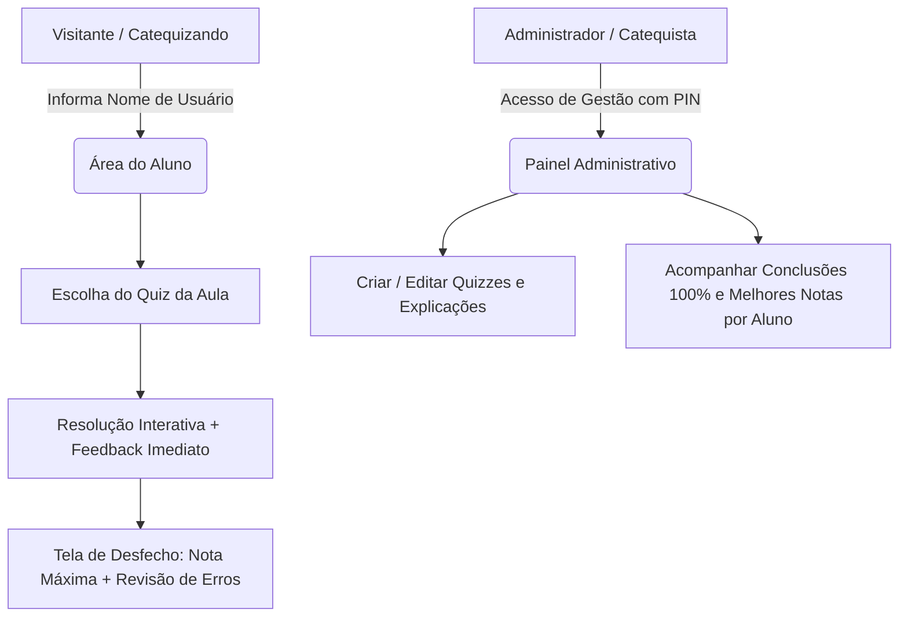

# Documento Executivo do Projeto: Fides et Ratio
> **Plataforma Interativa de Formação Catequética e Apologética Cristã**

---

| Metadado | Informação |
| :--- | :--- |
| **Projeto** | Fides et Ratio (Fé e Razão) |
| **Status do Documento** | 🟢 **APROVADO / EM IMPLEMENTAÇÃO** |
| **Versão** | 0.2.0 |
| **Data de Criação** | 08 de Outubro de 2026 |
| **Responsável Executivo** | zrhyan & Antigravity |
| **Ambiente de Hospedagem Alvo** | GitHub + Netlify (deploy contínuo gratuito) |

---

## 1. Visão Geral e Propósito

O projeto **Fides et Ratio** (expressão latina para *"Fé e Razão"*, célebre encíclica de São João Paulo II) nasce no seio de um apostolado de catequese e formação católica voltado à evangelização, ao aprofundamento doutrinal e ao combate ao fideísmo. A proposta é guiar os participantes através da harmonia entre intelecto e fé, partindo das vias clássicas da existência de Deus (Patrística, Santo Agostinho, Escolástica, São Tomás de Aquino) até questões contundentes do cristianismo.

Com a aproximação do **Segundo Encontro** (marcado para este sábado), surge a necessidade pedagógica e formativa de uma aplicação web que disponibilize testes interativos (*quizzes*) baseados nos conteúdos ministrados no **Primeiro Encontro** e nos encontros subsequentes.

### 1.1 Objetivos de Negócio & Pedagógicos
1. **Fixação Ativa do Conteúdo:** Permitir que catequizandos e interessados testem seus conhecimentos de forma autodidata e dinâmica.
2. **Pedagogia do Erro e do Acerto:** Cada alternativa (certa ou incorreta) deve oferecer uma justificativa explicativa sólida, transformando até o erro em oportunidade de aprendizado teológico e filosófico.
3. **Critério para Certificação e Continuidade:** O administrador precisa monitorar quais participantes obtiveram 100% de aproveitamento em cada módulo, requisito para concessão do certificado final e progressão nos estudos.
4. **Agilidade no Acesso:** Eliminar qualquer barreira de entrada (sem senhas burocráticas para estudantes), mantendo um fluxo veloz e agradável via smartphones.

---

## 2. Personas e Perfis de Acesso

### Persona 1: O Catequizando / Estudante (Usuário Normal)
- **Perfil:** Amigos e participantes dos encontros catequéticos, acessando predominantemente via **smartphone**.
- **Necessidades:** Identificação descomplicada (apenas nome), navegação visualmente rica, clareza sobre o tamanho do quiz, explicações imediatas para não ter dúvidas e facilidade para tentar novamente até dominar o assunto (100%).

### Persona 2: O Formador / Administrador
- **Perfil:** Responsável pela elaboração das aulas, condução dos encontros e validação da turma.
- **Necessidades:** Cadastrar novas perguntas e respostas com facilidade conforme as aulas ocorrem, e ter uma visão consolidada de quem atingiu 100% em cada quiz para emissão de certificados. Protegido por PIN mestre simples.

---

## 3. Histórias de Usuário (User Stories - Scrum/Agile)

### Épico 1: Experiência do Estudante (Quiz Player & Aprendizado)

#### US01: Identificação Simplificada e Seleção de Quiz
- **Como um:** Usuário normal (estudante),
- **Eu quero:** Inserir apenas meu nome de usuário (sem senha obrigatória) e escolher qual quiz referente a qual aula desejo realizar,
- **Para que:** Minhas tentativas e estatísticas fiquem salvas na minha conta e eu possa avançar conforme os temas das aulas progridem.
- **Critérios de Aceitação:**
  - O sistema deve solicitar um nome de identificação (ex: "Carlos Silva").
  - Caso o usuário já tenha acessado anteriormente com esse nome no dispositivo ou na base, deve recuperar seus recordes anteriores.
  - A tela inicial pós-identificação deve listar os quizzes disponíveis (ex: *"Aula 1: A Existência de Deus e o Combate ao Fideísmo"*).

#### US02: Indicador de Progresso e Contexto
- **Como um:** Usuário normal,
- **Eu quero:** Visualizar claramente quantas perguntas existem no quiz selecionado e em qual pergunta estou no momento,
- **Para que:** Eu tenha noção exata da extensão do teste e saiba se estou perto ou longe de concluir.
- **Critérios de Aceitação:**
  - Exibição de indicador textual (ex.: *"Pergunta 3 de 10"*) e barra de progresso visual fluida no topo da tela.

#### US03: Feedback Imediato de Resposta
- **Como um:** Usuário normal,
- **Eu quero:** Saber imediatamente após selecionar uma alternativa se a resposta foi correta ou incorreta,
- **Para que:** Eu não precise esperar o fim do teste para saber se acertei a questão.
- **Critérios de Aceitação:**
  - A alternativa clicada deve mudar de estado visual (dourado/esmeralda para acerto, rubro/carmesim para erro).
  - As opções ficam bloqueadas para novos cliques após a confirmação da resposta.

#### US04: Explicações Pedagógicas Detalhadas (Justificativas de Alternativa)
- **Como um:** Usuário normal,
- **Eu quero:** Que ao escolher uma alternativa correta surja um texto explicando o porquê de ela estar certa, e ao selecionar uma alternativa errada surja uma explicação detalhando por que aquela escolha é incorreta,
- **Para que:** Eu compreenda os fundamentos teológicos/filosóficos tanto do acerto quanto do erro.
- **Critérios de Aceitação:**
  - Cada alternativa individual de uma questão deve possuir sua justificativa cadastrada.
  - Um card explicativo bem estilizado deve ser renderizado logo abaixo das alternativas após o clique.
  - O botão de avançar para a próxima pergunta só fica visível ou habilitado após a leitura da explicação.

#### US05: Relatório Final de Resultados e Revisão de Erros
- **Como um:** Usuário normal,
- **Eu quero:** Que ao concluir a última pergunta eu veja a contagem de acertos/erros e tenha acesso a um botão de "Revisar Erros",
- **Para que:** Eu veja apenas as questões em que falhei, com a indicação da resposta correta e a respectiva explicação doutrinária.
- **Critérios de Aceitação:**
  - Exibição da porcentagem e contagem (ex.: *"8 de 10 acertos - 80%"*).
  - Feedback visual parabenizando se obteve 100% (*"Parabéns! Módulo Concluído com Maestria!"*).
  - Modal ou seção dedicada listando cada questão errada, a alternativa que o usuário marcou incorretamente e a alternativa correta acompanhada da justificação.

#### US06: Retentativa Rápida (Refazer Quiz)
- **Como um:** Usuário normal,
- **Eu quero:** Um botão direto de "Refazer Quiz" na tela de desfecho,
- **Para que:** Eu possa iniciar imediatamente uma nova tentativa e buscar a nota máxima de 100%.
- **Critérios de Aceitação:**
  - Reinicia o questionário limpando o estado atual de respostas e recolocando o usuário na Pergunta 1.

---

### Épico 2: Gestão do Catequista (Administração e Acompanhamento)

#### US07: Criação e Customização de Quizzes
- **Como um:** Administrador do site,
- **Eu quero:** Uma área administrativa protegida por PIN mestre para cadastrar novos quizzes, adicionando título, descrição, perguntas, alternativas e justificativas para cada opção,
- **Para que:** Eu alimente a plataforma com facilidade antes ou depois de cada encontro catequético.
- **Critérios de Aceitação:**
  - Formulário estruturado:
    - Dados do Quiz: Título (ex: *"Aula 1: A Existência de Deus"*), Descrição sumária.
    - Perguntas: Enunciado da pergunta.
    - Alternativas: Lista de alternativas (mínimo 2, padrão 4), marcação de qual é a correta.
    - Justificativa/Explicação para cada uma das alternativas (por que é certa ou por que é errada).
  - Capacidade de salvar e disponibilizar o quiz para os alunos.

#### US08: Painel de Conclusão e Melhores Notas (High Score)
- **Como um:** Administrador do site,
- **Eu quero:** Visualizar uma tabela com todos os usuários cadastrados e o melhor resultado (nota mais alta) obtido por cada um em cada quiz,
- **Para que:** Eu identifique quem alcançou 100% de aproveitamento em alguma das suas tentativas para fins de certificação e aptidão para o próximo encontro.
- **Critérios de Aceitação:**
  - O sistema deve reter a **nota mais alta histórica** do aluno (ex: se o aluno tirou 100% na 2ª tentativa e 80% na 3ª, o sistema preserva 100%).
  - Destaque visual (ex: selo dourado ou badge sacro "Concluído / 100%") para alunos aptos ao certificado.
  - Filtro ou ordenação por Quiz e por Status de Conclusão (100% alcançado vs. Em progresso).

---

## 4. Requisitos Não-Funcionais (RNF)

| Identificador | Requisito | Detalhamento |
| :--- | :--- | :--- |
| **RNF01 - Estética Sacra Medieval** | Identidade Visual "Fides et Ratio" | Visual solene e imersivo, remetendo a manuscritos iluminados, mosteiros medievais, tratados escolásticos e obras de Santo Agostinho e São Tomás de Aquino. Paleta: pergaminho nobre (`#0d0c0a` / `#16130f` dark mode e pergaminho vintage acentuado), dourado antigo sacramental (`#D4AF37`), vinho litúrgico carmesim (`#80182A`), azul lápis-lazúli (`#1B3B6F`). Tipografia: *Cinzel*, *Cinzel Decorative*, *Cormorant Garamond* para títulos e *Inter* para leitura suave. |
| **RNF02 - Mobile First & Desempenho** | Otimização para Celulares | Como a maioria dos participantes responderá pelo celular, a interface deve ser ultra leve, touch-friendly (botões com área de toque mínima de 44x44px), sem lentidão e com resposta instantânea. |
| **RNF03 - Arquitetura de Deploy Gratuito** | Compatibilidade Netlify | O projeto compila como SPA moderna com Vite + React + Tailwind CSS no Netlify, com CI/CD vinculado a repositório GitHub. |
| **RNF04 - Persistência Centralizada** | Compartilhamento em Nuvem | Integração com Supabase (PostgreSQL gratuito em nuvem) com fallback gracioso local offline para resiliência máxima. |

---

## 5. Arquitetura Técnica e Decisões Consolidadas

1. **Frontend:** **Vite + React (com TypeScript/JavaScript moderno) + Tailwind CSS** (definido e aprovado pelo usuário).
2. **Backend & Banco de Dados:** **Supabase** (PostgreSQL gratuito, real-time, client leve via `@supabase/supabase-js`, com camada de fallback inteligente para armazenamento local se as chaves da API ainda não forem configuradas).
3. **Segurança do Administrador:** PIN Mestre de Acesso (padrão: `veritas`, alterável nas configurações).
4. **Conteúdo do Quiz (Encontro 1):** Estrutura pré-carregada e pronta; na fase de consolidação do conteúdo, o usuário fornecerá as perguntas definitivas redigidas pela equipe.
