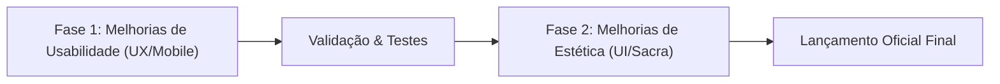

# Plano de Refinamento: Fases de Usabilidade e Estética

> **Documento Normativo e Operacional para Agentes de IA e Desenvolvedores**  
> **Projeto:** Fides et Ratio (Plataforma Interativa de Formação e Quiz Doutrinário)  
> **Status:** Em Planejamento / Fase 1 Ativa  
> **Última Atualização:** 09 de Outubro de 2026

---

## 1. Visão Geral das Duas Fases

Após a conclusão bem-sucedida do desenvolvimento central, integração à nuvem (Supabase) e deploy em produção (Netlify), o projeto entra em seu ciclo de refinamento fino antes da disponibilização pública oficial para os catequizandos e amigos.

Esse ciclo é dividido estritamente em **duas fases sequenciais**:



1. **Fase 1 — Usabilidade e Ergonomia (Foco Atual):** Varrer sistematicamente a aplicação para tornar a navegação suave, legível, fluida e intuitiva, especialmente na experiência mobile (smartphones).
2. **Fase 2 — Estética e Polimento Visual Sacro:** Refinamento artístico medieval, micro-interações, tipografia nobre, iluminação e acabamentos ornamentais (detalhes serão especificados após o término da Fase 1).

---

## 2. Fase 1: Diretrizes de Execução (Guia para IAs)

> ⚠️ **INSTRUÇÃO OBRIGATÓRIA PARA A IA QUE EXECUTAR ESTA FASE:**  
> Não inicie alterações aleatórias de código de imediato. A execução da Fase 1 deve seguir estritamente o método de 3 etapas:  
> 1. **Varrer e Mapear** todos os componentes e dados em busca de pontos de atrito.  
> 2. **Documentar e Listar** todas as oportunidades de melhoria com exemplos concretos e priorização.  
> 3. **Implementar e Validar** as correções de forma cirúrgica e atômica.

### 2.1 Eixos de Análise Obrigatórios na Varredura

Qualquer IA que assumir a execução da Fase 1 deve inspecionar os seguintes 5 eixos:

#### Eixo A: Tipografia e Formatação Estruturada de Textos Longos (Exemplo do Silogismo)
* **Problema Concreto Identificado:** Questões com silogismos (ex.: Premissa 1, Premissa 2, Conclusão), formulações lógicas $\langle\Gamma, \psi\rangle$ ou citações bíblicas/patrísticas atualmente renderizam como blocos de texto contínuos (`whitespace-normal` padrão em `<h2 className="...">{currentQuestion.question}</h2>`), ignorando as quebras de linha (`\n`) presentes nos dados ou tornando a leitura densa e cansativa no celular.
* **O que avaliar:**
  * Uso de `whitespace-pre-line` ou componentes formatadores dedicados em enunciados (`QuizPlayer.jsx`), revisões (`QuizResult.jsx`) e feedbacks.
  * Destaque visual (caixas de destaque, recuo, fontes mono/serifadas) para silogismos e passagens de autores clássicos (Santo Agostinho, São Tomás, Lewis).

#### Eixo B: Ergonomia Touch e Zonas de Toque Mobile (Fitts's Law)
* **O que avaliar:**
  * Área de clique das alternativas: padding suficiente (mínimo de 44-48px de altura de toque).
  * Distância segura entre botões principais para evitar toques acidentais em telas pequenas (ex.: botão "Próxima Questão" vs alternativas, ou "Sair do Quiz" vs "Refazer").
  * Feedback tátil/visual imediato ao toque (`active:scale-[0.98]`, transições sem atraso perceptual).

#### Eixo C: Layout e Quebra de Elementos em Telas Estreitas (< 380px)
* **O que avaliar:**
  * Cabeçalho (`Header.jsx`): comportamento do selo sacro, nome do usuário longo e botão "Catequista" em aparelhos compactos (iPhone SE, Galaxy A-series).
  * Cartão de pontuação (`QuizResult.jsx`): grade de 3 colunas (Aproveitamento, Acertos, Erros) não deve truncar valores ou sobrepor legendas.
  * Tabela do Painel do Catequista (`AdminPanel.jsx`): garantir rolagem horizontal suave (`overflow-x-auto`) ou exibição em formato de cards responsivos para visualização das notas via smartphone.

#### Eixo D: Feedback Cognitivo e Estados de Carregamento
* **O que avaliar:**
  * Clareza dos feedbacks explicativos após a resposta: o aluno compreende de imediato por que errou sem precisar rolar excessivamente a tela?
  * Scroll automático suave (`window.scrollTo({ behavior: 'smooth' })`) ao avançar para a próxima questão ou ao abrir a sanfona de revisão de erros.
  * Estados vazios (*empty states*) amigáveis caso a busca de alunos no painel não encontre registros.

#### Eixo E: Fluxo de Entrada e Continuidade de Sessão
* **O que avaliar:**
  * Modal de identificação (`UserModal.jsx`): facilidade de digitação com auto-foco, fechamento de teclado virtual mobile e clique em "Entrar".
  * Troca ou logout de usuário simplificada caso dois catequizandos usem o mesmo celular sequencialmente.

---

## 3. Roteiro Passo a Passo para a IA Executora da Fase 1

```markdown
### Checklist Operacional da IA:
- [ ] 1. Ler os arquivos principais:
       - `src/components/QuizPlayer.jsx`
       - `src/components/QuizResult.jsx`
       - `src/components/Header.jsx`
       - `src/components/UserModal.jsx`
       - `src/components/AdminPanel.jsx`
       - `src/components/CertificateModal.jsx`
       - `src/data/defaultQuizzes.js`
- [ ] 2. Produzir o Relatório Diagnóstico de Usabilidade (listando problemas encontrados + soluções propostas).
- [ ] 3. Apresentar o relatório ao usuário antes ou durante a aplicação das melhorias.
- [ ] 4. Executar as melhorias de código sem quebrar nenhuma regra doutrinária ou de negócio.
- [ ] 5. Rodar `npm run build` para garantir ausência de erros de build e tipagem.
- [ ] 6. Atualizar a documentação e commits.
```

---

## 4. Fase 2: Antevisão da Estética (Aguardando ativação)

*A ser detalhada e iniciada exclusivamente após a aprovação da Fase 1 pelo usuário.*
* **Escopo previsto:** Harmonização de contrastes litúrgicos, texturas de pergaminho manuscrito, acabamentos dourados nas bordas, refinamento visual do certificado iluminado e tipografia escolástica.
